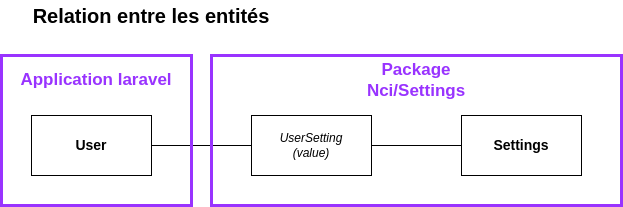

# NCI Settings

Objectif : gérer les paramètres de l'application au travers d'objets gérable en base de données

---

## Modèle Setting

| Attribut    | Description                                                                          | Requis | Default       |
| ----------- | ------------------------------------------------------------------------------------ | ------ | ------------- |
| id          | Identifiant numérique du paramètre dans la table                                     | x      |               |
| group       | Chaine de caractère permettant de grouper un bloc de paramètres                      | x      | 'core'        | core.subcat.subsubcat
| scope       | Portée du paramètre: 'Application' / 'Rôle'                                          | x      | 'application' | 'application' ou 'user'
| code        | Identifiant texte du paramètre                                                       | x      |               | terminalFont
| description | Explication du paramètre en Français                                                 | x      |               | Lorem ipsum et bla bla
| type        | type du paramètre: Boolean, Number, String, Array, Json                              | x      |               |
| json_otpions| {"type":"array/jsonarray/jsonsql","data":[]} ou null                                 |        |               |
| nullable    | Boolean indiquant si le paramètre peut être null ou non                              | x      |               |
| default     | Valeur par défaut du paramètre                                                       |        |               |
| favorite    | Indique si le paramètre est souvent utilisé ou non                                   | x      | false         |
| width       | Largeur du champ de saisie '1/4', '1/3', '1/2', '2/3', '3/4', 'full'                 | x      | 1/4           |

## Types Spécifiques
- Array
```json
['Item1', 'Item2', 'Item3']
```

- JsonArray
> L'attribut `code` sera le plus souvent traduit en front (i18n) pour devenir un `label`
```json
[
  {"code": [ItemID1], "value": [ItemValue1]},
  {"code": [ItemID2], "value": [ItemValue2]},
  {"code": [ItemID3], "value": [ItemValue3]},
]
```

- JsonSQL
> L'attribut `code` sera le plus souvent traduit en front (i18n) pour devenir un `label`
```json
{
  "select": "item1 as code, item2 as value",
  "from"  : "tableName",
  "where" : "item3 > 10" // condition éventuellement
}
```

## Modèle UserSetting
| Attribut     | Description                             | Requis | Default |
| ------------ | --------------------------------------- | ------ | ------- |
| user_id      | Identifiant numérique du modèle user    | x      |         |
| setting_id   | Identifiant numérique du modèle setting | x      |         |
| value        | Valeur à utiliser pour l'utilisateur    | x      |         |

----

## Fonctions du code Métier
```php

// Retourne tous les groupes de paramètres
public static function Setting::groups(): collection<Setting>

// set options
public static function Setting::setOptions(Setting $setting, string $options);

// set default
public static function Setting::setDefault(Setting $setting, string $value);

// Retourne la liste de tous les paramètres confondus
public static function Setting::app(string $group = null): array;
public static function Setting::user(User $user, string $group = null): array;

// set value
public static function Setting::setForApp(Setting $setting, value);
public static function Setting::setForUser(User $user, Setting $setting, value);

// Retourne le paramètre identifié par "code".
public static function Setting::find(int $id): stdClass;
public static function Setting::findByCode(string $code): stdClass;


// Ca serait bien
$user->setting($code)

// Ca serait topisime
app()->setting($code);


```

---

## Schema


